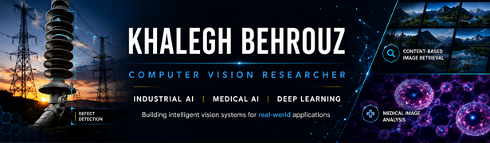

  

### Hi, I'm Khalegh Behrouz
### PhD Candidate in Artificial Intelligence
**Computer Vision • Industrial AI • Medical AI • Deep Learning**

*Building intelligent vision systems that bridge academic research and real-world applications.*

---

## About Me

I am a PhD candidate in Artificial Intelligence and a university lecturer with a strong interest in **Computer Vision** and **Deep Learning**.

My research focuses on developing intelligent visual systems for industrial inspection, medical and biomedical image analysis, and content-based image retrieval. I enjoy transforming research ideas into practical AI solutions that address real-world challenges.

---

## Research Interests

- Industrial AI
- Computer Vision
- Deep Learning
- Medical Image Analysis
- Content-Based Image Retrieval (CBIR)
- Image Processing
- Machine Learning
- Instance Segmentation
- Explainable AI
- Vision Transformers

---

## Featured Projects

### 🏭 Industrial AI

- **Transmission Line Insulator Defect Detection**
  - Instance segmentation using Matterport Mask R-CNN (TensorFlow 2 compatible)
  - Automatic visual inspection for power transmission systems

### 🖼️ Computer Vision

- **Content-Based Image Retrieval (CBIR)**
  - Deep feature extraction
  - Feature fusion
  - Similarity learning
  - CNN-based image retrieval

### 🔬 Medical AI

- **Cellular Phenotype Recognition**
  - Deep learning for biomedical image analysis
  - Cell image classification and recognition

---

## Teaching Experience

University Lecturer

Courses taught:

- Artificial Intelligence
- Python Programming
- C and C++ Programming
- R Programming
- Java Programming
- Data Structures

---

## Technical Skills

### Programming Languages

- Python
- C and C++
- R
- Java

### AI & Deep Learning

- TensorFlow
- Keras
- OpenCV
- Scikit-learn

### Computer Vision

- Face Detection
- Object Tracking
- Object Detection
- Instance Segmentation
- Image Segmentation
- Feature Extraction
- Image Retrieval
- Image Processing

### Development Tools

- Git
- GitHub
- Google Colab
- Jupyter Notebook
- VS Code
- Spyder

---

## Current Research

Currently exploring:

- Industrial Computer Vision
- Intelligent Visual Inspection
- Vision Transformers (ViT)
- Explainable AI (XAI)
- Foundation Models
- Multimodal AI

---

## Research Philosophy

> Artificial Intelligence creates the greatest impact when research is transformed into reliable systems that solve real-world problems.

---

## Publications & Profiles

📚 Google Scholar: *([Profile link](https://scholar.google.com/citations?user=LeJ5ocwAAAAJ&hl=en&authuser=1))*

🆔 ORCID: *[([ORCID link](https://orcid.org/0000-0002-4461-3699))]*

💼 LinkedIn: *([LinkedIn profile](https://ir.linkedin.com/in/khalegh-behrouz-9bb1939b))*

---

## GitHub Portfolio

This GitHub serves as my professional portfolio, where I share:

- Research projects
- Computer Vision implementations
- Industrial AI applications
- Medical AI projects
- Educational materials
- Open-source code

---

## Collaboration

I am always interested in collaborations involving:

- Computer Vision
- Industrial AI
- Medical AI
- Deep Learning
- Intelligent Vision Systems
- Academic and Open-source Research

---

### ⭐ Thank you for visiting my GitHub profile!

*"Research • Build • Share"*

